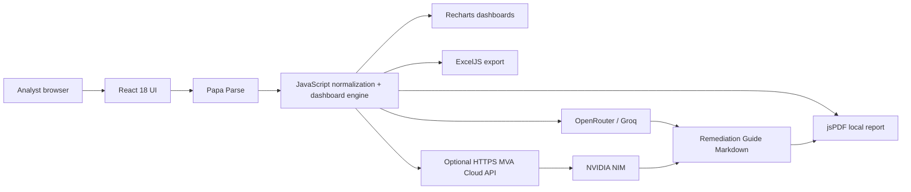

# MVA Unified Agent Architecture and Stack

Current as of 14 July 2026. For field mappings, formulas, reconstruction steps, samples, and acceptance tests, use `docs/FINAL_PRODUCTION_HANDOVER.md`.

## Runtime Architecture



The public frontend has no database and no server-side scanner upload. CSV parsing, normalization, comparison, dashboards, Excel, and normalized CSV all run in the browser.

## Stack

| Layer | Technology | Purpose |
|---|---|---|
| Frontend | React 18 | Component/state architecture and workflows |
| Build | Vite 6 | Development, production bundling, GitHub Pages base path |
| Styling | Tailwind CSS 3 + custom CSS | High-control responsive cybersecurity UI |
| Charts | Recharts | Line, bar, age/priority, and micro trend visuals |
| Icons | Lucide React + custom source marks | Accessible visual language |
| CSV | Papa Parse | CSV parsing and worker mode for large files |
| Excel | ExcelJS | Browser-generated formatted workbook |
| PDF | jsPDF | Browser-generated Remediation Guide |
| Reference engine | Python 3 | Independent source and dashboard regression oracle |
| Reference PDF | ReportLab | Deterministic final team artifact and visual QA |
| Hosting | GitHub Pages + Actions | Public static deployment |
| Optional backend | Python API prototype | NVIDIA proxy and enterprise provider custody |
| Storage | None | Stateless upload-process-download design |

## Implemented Sources

```text
Tenable.sc: adhoc + multi-month
Tenable.io: adhoc + multi-month, native vuln_age support
Qualys VMDR monthly: adhoc + multi-month
Qualys VMDR adhoc: adhoc
CrowdStrike Vulnerabilities: adhoc + multi-month
CrowdStrike Vulnerability per asset: adhoc + multi-month
CrowdStrike Remediation per assets: weighted adhoc only
```

MDVM and Custom CSV remain disabled until mappings and tests exist.

## Frontend Components

| File | Responsibility |
|---|---|
| `react-ui/src/App.jsx` | Source/mode routing and analysis state |
| `react-ui/src/components/SourceChoice.jsx` | Scanner selection |
| `react-ui/src/components/OperationMode.jsx` | Adhoc versus monthly mode |
| `react-ui/src/components/UploadPanel.jsx` | Single-file upload |
| `react-ui/src/components/MonthlyComparison.jsx` | Multi-file gate and five required views |
| `react-ui/src/components/AiReportBuilder.jsx` | Provider, target month, connectivity, PDF generation |
| `react-ui/src/lib/vulnerabilityEngine.js` | Detection, normalization, priority, aging, movement |
| `react-ui/src/lib/reportExport.js` | Excel and normalized CSV |
| `react-ui/src/lib/pdfReport.js` | AI prompt, template Markdown, PDF renderer |
| `react-ui/src/lib/aiProviders.js` | Provider catalog, validation, OpenAI-compatible requests |

## AI Routes

| UI option | Model | Route |
|---|---|---|
| OpenRouter - Nemotron 3 Ultra | `nvidia/nemotron-3-ultra-550b-a55b:free` | Direct browser-compatible API |
| Groq - GPT OSS 120B | `openai/gpt-oss-120b` | Direct browser-compatible API |
| NVIDIA NIM - MVA Cloud Proxy | `nvidia/nemotron-3-ultra-550b-a55b` | HTTPS MVA API, then NVIDIA |
| MVA Cloud API | Organization-selected model | `/health` and `/generate/pdf` |
| Template PDF - No AI | None | Local browser |

NVIDIA's Build endpoint is valid server-to-server but does not support the direct browser CORS path required by GitHub Pages. Use the proxy route for an NVIDIA key.

## Optional API Contract

Prototype: `tools/mva_api_server.py`

```text
GET  /health
POST /health/nvidia
POST /generate/pdf
```

Production controls must include HTTPS, authentication, an exact CORS origin allowlist, secret management, request/token limits, redacted logs, and outbound provider allowlisting.

## Data Boundary

```text
Always local:
- raw CSV parsing
- source detection
- normalization
- month comparison
- dashboards
- Excel
- normalized CSV
- template PDF

Sent only after Generate PDF Report:
- source label
- selected month
- dashboard summary
- at most 80 highest-priority normalized findings
```

## Hosting

Repository:

```text
https://github.com/DrHayabusa/unified-tool
```

Frontend:

```text
https://drhayabusa.github.io/unified-tool/
```

Deployment workflow:

```text
.github/workflows/deploy-pages.yml
```

## Validation Gates

```bash
python3 -m unittest -v tests.test_crowdstrike_and_regressions
python3 tools/run_release_validation.py
node tools/run_browser_80k_validation.mjs
cd react-ui
npm test
npm run build
npm audit --audit-level=moderate
```

Final evidence is under `output/validation/`.
