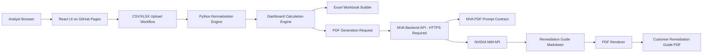
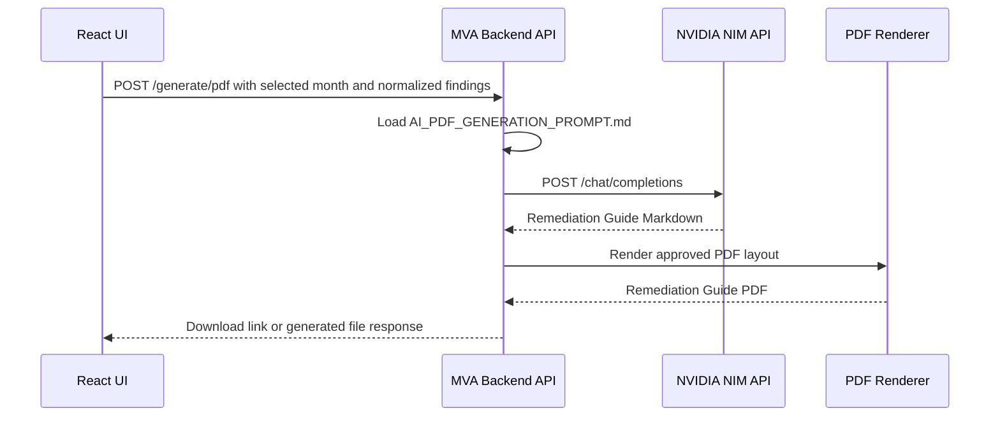
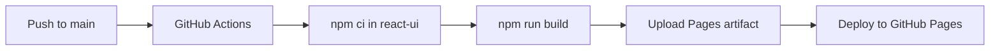

# MVA Unified Agent Architecture and Stack

This document explains how the MVA Unified Agent was built, what each layer does, what is live today, and what still needs to be deployed for a production team rollout.

## 1. Current Status

| Area | Status | Notes |
|---|---:|---|
| Public frontend | Live | GitHub Pages serves the React UI at `https://drhayabusa.github.io/unified-tool/`. |
| Scanner normalization | Implemented | Tenable.sc, Tenable.io, and Qualys CSV formats are supported in the Python engine. |
| Monthly comparison logic | Implemented | Multi-month open, new, not closed, remediated, patch priority, and age dashboards are implemented. |
| Adhoc dashboard logic | Implemented | Single-file totals, severity counts, priority counts, and top affected assets are implemented. |
| Excel output | Implemented | Workbooks are generated through `tools/build_tenable_dashboard_workbook.mjs`. |
| PDF layout samples | Implemented | ReportLab sample PDFs are generated from scripts in `tools/`. |
| AI remediation prompt contract | Implemented | The NVIDIA request uses `docs/AI_PDF_GENERATION_PROMPT.md`. |
| Cloud backend API | Not deployed yet | `tools/mva_api_server.py` exists, but it must be hosted on an HTTPS backend before the public UI can generate AI PDFs in the cloud. |
| Database | Not used | Current architecture is intentionally no-DB. Files are uploaded, processed, and exported without persistent storage. |

## 2. Live URLs and Repositories

| Item | Value |
|---|---|
| GitHub repository | `https://github.com/DrHayabusa/unified-tool` |
| Live frontend | `https://drhayabusa.github.io/unified-tool/` |
| Frontend deployment method | GitHub Actions to GitHub Pages |
| Backend API URL | Pending production deployment |
| NVIDIA provider base URL | `https://integrate.api.nvidia.com/v1` |
| Default NVIDIA model route | `nvidia/nemotron-3-ultra-550b-a55b` |

## 3. Product Goal

MVA Unified Agent is a vulnerability intake and remediation cockpit. The intended production behavior is:

1. Analyst selects a scanner source such as Tenable.sc, Tenable.io, Qualys, MDVM, CrowdStrike, or Custom CSV.
2. Analyst selects an operation mode: Adhoc Scan or Monthly Data Comparison.
3. Analyst uploads scanner exports.
4. The engine normalizes raw scanner fields into a consistent MVA schema.
5. The engine calculates exploit availability, patch priority, exposure score, aging, open findings, new findings, and remediated findings.
6. The platform generates analyst-ready dashboards, Excel reports, and Remediation Guide PDFs.
7. If AI generation is selected, a backend API sends the normalized findings and strict PDF prompt to the selected AI provider.

## 4. Technology Stack

| Layer | Technology | Why it was chosen |
|---|---|---|
| Frontend framework | React 18 | Gives full UI/UX control, reusable components, state-driven workflows, and production-grade dashboard flexibility. |
| Frontend bundler | Vite | Fast development server, simple production builds, and clean GitHub Pages deployment. |
| Styling | Tailwind CSS | High-control custom cybersecurity UI without being locked into Streamlit defaults. |
| Charts | Recharts | React-native chart components for sparklines, trend lines, bars, and dashboard visuals. |
| Icons | Lucide React | Lightweight SVG icon system for sidebar, cards, source tools, and actions. |
| Hosting | GitHub Pages | Free static frontend hosting for easy team access and demos. |
| Backend API | Python standard library HTTP server prototype | Simple API layer for health checks and AI/PDF generation without framework overhead. |
| Data engine | Python | Best fit for CSV parsing, normalization, date logic, and vulnerability calculations. |
| Excel generation | Node.js plus `@oai/artifact-tool` | Produces formatted XLSX workbooks with charts and sheets. |
| PDF generation | Python ReportLab | Generates controlled customer-facing PDF layouts and command blocks. |
| AI provider | NVIDIA NIM / NVIDIA Build API | OpenAI-compatible chat completion route for remediation guide generation. |
| Secrets | `.env` or backend environment variables | Keeps API keys outside the React frontend and outside GitHub. |
| Database | None | Current version is stateless and file-driven. |

## 5. High-Level Architecture



Important note: the public GitHub Pages UI cannot securely call NVIDIA directly with a private key. In production, the UI must call the MVA backend API. The backend stores the provider key and calls NVIDIA.

## 6. Frontend Architecture

Frontend path:

```text
react-ui/
```

Main frontend files:

| File | Purpose |
|---|---|
| `react-ui/src/App.jsx` | Main application shell and workflow state. |
| `react-ui/src/main.jsx` | React entry point. |
| `react-ui/src/index.css` | Tailwind CSS and custom dark cybersecurity visual system. |
| `react-ui/src/components/Sidebar.jsx` | Main navigation. |
| `react-ui/src/components/HeroHeader.jsx` | Top identity/header area. |
| `react-ui/src/components/SourceChoice.jsx` | Source tool selector for Tenable.sc, Tenable.io, Qualys, MDVM, CrowdStrike, and Custom CSV. |
| `react-ui/src/components/OperationMode.jsx` | Adhoc Scan vs Monthly Data Comparison cards. |
| `react-ui/src/components/UploadPanel.jsx` | Upload interaction panel. |
| `react-ui/src/components/MetricsRow.jsx` | KPI cards with small chart visuals. |
| `react-ui/src/components/MonthlyComparison.jsx` | Monthly comparison dashboard view. |
| `react-ui/src/components/AiReportBuilder.jsx` | AI provider, API connectivity, target month, and PDF generation UI. |
| `react-ui/src/components/PriorityMatrix.jsx` | MVA patch priority matrix display. |
| `react-ui/src/components/FieldMappingPanel.jsx` | Field mapping summary panel. |
| `react-ui/src/components/TrendPanel.jsx` | Trend visualization panel. |
| `react-ui/src/components/RemediationQueue.jsx` | Remediation queue style table. |
| `react-ui/src/components/ToolIcons.jsx` | Custom source tool symbols. |
| `react-ui/src/data/dashboardData.js` | Mock/demo dashboard data used by the static UI. |

Frontend package:

```json
{
  "framework": "React 18",
  "bundler": "Vite",
  "styling": "Tailwind CSS",
  "charts": "Recharts",
  "icons": "Lucide React"
}
```

## 7. Backend API Architecture

Backend prototype file:

```text
tools/mva_api_server.py
```

Implemented API routes:

| Route | Method | Purpose |
|---|---|---|
| `/health` | GET | Basic API health check. |
| `/health/nvidia` | GET or POST | Tests whether NVIDIA API connectivity works. |
| `/generate/pdf` | POST | Builds the strict Remediation Guide prompt and sends it to NVIDIA when provider settings request NVIDIA. |

Current backend behavior:

1. Loads private settings from `.env` or environment variables.
2. Accepts optional session-provided API settings from the UI for testing.
3. Builds the PDF prompt using `docs/AI_PDF_GENERATION_PROMPT.md`.
4. Sends a chat completion request to NVIDIA when the provider is NVIDIA.
5. Returns generated Markdown to the caller.
6. Leaves final production PDF rendering as the backend responsibility.

Production backend requirement:

The backend must be deployed behind HTTPS before the public GitHub Pages UI can use it reliably. A production backend URL should look like:

```text
https://your-mva-api.example.com/health/nvidia
```

The UI field named `API Server Health URL` expects the MVA backend URL, not the NVIDIA provider URL.

## 8. AI Provider Architecture

The AI provider is not called directly from the public frontend in the secure production model.



NVIDIA default settings:

| Setting | Value |
|---|---|
| Base URL | `https://integrate.api.nvidia.com/v1` |
| Model | `nvidia/nemotron-3-ultra-550b-a55b` |
| API style | OpenAI-compatible chat completions |
| Key location | Backend environment variable, not frontend code |

Required environment variables:

```text
NVIDIA_API_KEY=<private key stored only on backend>
NVIDIA_BASE_URL=https://integrate.api.nvidia.com/v1
NVIDIA_MODEL=nvidia/nemotron-3-ultra-550b-a55b
```

## 9. Data Engine Architecture

Data engine path:

```text
mva_engine/
```

Core files:

| File | Purpose |
|---|---|
| `mva_engine/tenable_normalizer.py` | Detects source format, normalizes scanner rows, calculates patch priority, calculates exposure, builds finding keys. |
| `mva_engine/tenable_dashboards.py` | Builds adhoc dashboards and monthly comparison dashboards from normalized findings. |
| `tools/tenable_dashboard_cli.py` | CLI entry point for generating dashboard JSON from sample CSV inputs. |

Supported source detection:

| Source | Detection signal | Status |
|---|---|---|
| Tenable.sc | Headers such as `IP Address`, `Plugin`, `Plugin Name` | Implemented |
| Tenable.io | Dot-notation headers such as `definition.*` and `asset.*` | Implemented |
| Qualys Monthly | Headers such as `QID`, `Title`, `Vuln Status` | Implemented |
| Qualys Adhoc | Headers such as `QID`, `Title`, `CVSS4 Base` | Implemented |
| MDVM | Field mapping pending | Planned |
| CrowdStrike | Field mapping pending | Planned |
| Custom CSV | Mapping UI and schema pending | Planned |

## 10. Normalized MVA Schema

The engine maps raw scanner fields into this normalized reporting schema:

```text
IP Address
DNS Name
Vulnerability Name
CVE
Severity
Exploit Availability
Patch Priority
Asset Exposure
Vulnerability Finding
Summary
Description
Remediation
KB Links
Platform Details
First Discovered
Last Observed
Source Tool
Reporting Date
```

This schema is what should be sent to the Excel builder and AI PDF generator. Raw scanner-only fields should not be sent to the AI unless they are required for remediation context.

## 11. Patch Priority Matrix

The patch priority logic is implemented in `mva_engine/tenable_normalizer.py`.

| Exploit Availability | Critical | High | Medium | Low |
|---|---:|---:|---:|---:|
| Yes / Available | P1 | P1 | P2 | P2 |
| No / Unavailable | P2 | P2 | P3 | P4 |

Exploit availability source fields:

| Source | Exploit fields used |
|---|---|
| Tenable.sc | `Exploit?`, `Exploit Ease`, `Exploit Frameworks` |
| Tenable.io | `definition.exploitability_ease`, `definition.exploited_by_malware`, `definition.exploited_by_nessus`, `definition.vpr_v2.drivers_exploit_code_maturity`, `definition.vpr_v2.drivers_exploit_probability` |
| Qualys | `Exploitability`, `Associated Malware` |

## 12. Dashboard Requirements Implemented

Monthly comparison dashboards implement the exact required comparison set:

| Requirement | Implementation |
|---|---|
| Trend of vulnerabilities discovered in last 3 months | `trend_discovered_last_3_months` line chart data. |
| Total open vulnerabilities | `new_vulnerabilities + not_closed_from_previous_months`. |
| Total open by patch priority | P1, P2, P3, P4 counters from current month open findings. |
| Total open by age and patch priority | P1/P2/P3/P4 vs `>7 days`, `>30 days`, `>60 days`, `>180 days`. |
| Total vulnerabilities patched in last month | `previous_month_open + new_this_month - current_month_open`. |

Adhoc dashboards implement:

| Requirement | Implementation |
|---|---|
| Total vulnerabilities | Count of normalized open findings. |
| Severity counts | Critical, High, Medium, Low, Info, Unknown. |
| Patch priority counts | P1, P2, P3, P4. |
| Top 10 affected assets | Grouped by DNS name or IP address. |

## 13. Excel Architecture

Excel builder:

```text
tools/build_tenable_dashboard_workbook.mjs
```

Workbook structure:

| Sheet | Purpose |
|---|---|
| `Executive Dashboard` | Customer-facing summary with KPI row, trend charts, priority split, age matrix, and patched formula. |
| `Monthly Dashboard` | Monthly comparison detail. |
| `Adhoc Dashboard` | Single-upload adhoc scan summary. |

Excel styling approach:

1. Light report-style workbook surface rather than heavy black backgrounds.
2. Consistent P1/P2/P3/P4 colors across Tenable.sc, Tenable.io, and Qualys.
3. Smaller line charts to avoid overlap.
4. Separate sections for discovered trend, remediated trend, priority distribution, age by priority, and patched last month.
5. No merged-cell-heavy layout that breaks workbook repair.

## 14. PDF Architecture

PDF prompt contract:

```text
docs/AI_PDF_GENERATION_PROMPT.md
```

PDF sample scripts:

| File | Purpose |
|---|---|
| `tools/generate_sample_pdfs.py` | Generates earlier sample PDF layouts. |
| `tools/generate_pdf_format_options.py` | Generates multiple format options for review. |
| `tools/generate_kb_remediation_pdf.py` | Creates KB-oriented remediation PDF samples. |
| `tools/generate_100plus_remediation_pdf.py` | Creates the 100-plus finding Remediation Guide sample. |

Approved PDF direction:

1. Report name: `Remediation Guide`.
2. Report type: `Remediation`.
3. Tool source: selected source from the agent.
4. No customer name.
5. No created-by line.
6. No internal wording such as "prepared from normalized KB links".
7. Clean table of contents.
8. Vulnerability sections with affected asset, CVE, links, remediation steps, command boxes, and validation.
9. Command blocks formatted like Notion or Obsidian.

## 15. Deployment Architecture

### Current frontend deployment

GitHub Actions workflow:

```text
.github/workflows/deploy-pages.yml
```

Build flow:



Production frontend build command:

```bash
cd react-ui
npm ci
npm run build
```

### Required backend deployment

To make AI PDF generation work for the team, deploy the backend API as a separate HTTPS service.

Recommended options:

| Option | Use when |
|---|---|
| Docker container on internal server | Best for enterprise internal hosting and network control. |
| Cloud VM | Simple if the organization already has a VM standard. |
| App service / container app | Best if the organization uses managed cloud services. |
| Kubernetes | Best only if the team already operates Kubernetes. |

Backend production requirements:

1. HTTPS endpoint.
2. CORS allow-list for `https://drhayabusa.github.io`.
3. `NVIDIA_API_KEY` stored in server-side environment variables.
4. No API keys in React source code.
5. File upload size limits defined.
6. Request timeout and queue handling for long PDF generation.
7. Optional authentication before team-wide usage.

## 16. Security Model

| Concern | Decision |
|---|---|
| API keys | Store only on backend or in local `.env`; never commit keys. |
| Frontend secrets | React bundles are public, so secrets must not be embedded. |
| Session API key field | For temporary testing only; sent to configured MVA backend when user clicks test/generate. |
| Scanner exports | Current no-DB architecture should process files transiently and avoid persistence unless explicitly configured. |
| AI data sharing | Send only normalized report fields needed for remediation. |
| GitHub Pages | Safe for static UI; not safe for storing private provider credentials. |
| Production backend | Should use HTTPS, CORS allow-list, logging controls, and authentication. |

## 17. No-Database Architecture

The requested production direction is high-end UI/UX without a database. The current design supports that:

1. CSVs are uploaded for the active session.
2. The normalizer reads the files and builds in-memory finding objects.
3. Dashboard JSON is generated from the current upload set.
4. Excel and PDF files are generated as outputs.
5. No vulnerability history is stored unless a future backend intentionally writes files to object storage.

Tradeoff:

| Benefit | Limitation |
|---|---|
| Simple deployment and less sensitive data retention | History pages cannot show old uploads unless a storage layer is later added. |
| Easier security review | Large file processing needs careful memory limits and streaming for production. |
| Good for customer-delivered reports | Multi-user collaboration needs a backend session or storage design later. |

## 18. React vs Streamlit Decision

React was chosen for the enterprise UI direction because:

1. It gives full control over layout, animations, dark cybersecurity visuals, and tool-specific workflows.
2. It separates the frontend from the backend, which is better for secure AI provider calls.
3. It can be deployed as a static app to GitHub Pages or any web server.
4. It supports richer dashboard interactions than Streamlit without Streamlit's default app look.
5. It is easier to evolve into a proper product with authentication, backend APIs, design systems, and reusable components.

Streamlit is still useful for quick internal prototypes, but React is the better fit for a polished enterprise platform.

## 19. Repository Map

```text
.
+-- .github/workflows/deploy-pages.yml
+-- docs/
|   +-- AI_PDF_GENERATION_PROMPT.md
|   +-- API_KEYS.md
|   +-- BUILD_REPLICATION_GUIDE.md
|   +-- COMPLETE_RECREATE_HANDOVER.md
|   +-- FINAL_HANDOFF_AND_TESTING.md
|   +-- GITHUB_PAGES_404_FIX.md
|   +-- TENABLE_FIELD_VALIDATION_AND_DASHBOARDS.md
|   +-- TENABLE_SC_IO_MAPPING.md
|   +-- ARCHITECTURE_AND_STACK.md
+-- mva_engine/
|   +-- __init__.py
|   +-- tenable_dashboards.py
|   +-- tenable_normalizer.py
+-- react-ui/
|   +-- package.json
|   +-- vite.config.js
|   +-- tailwind.config.js
|   +-- src/
+-- samples/
+-- tools/
|   +-- build_tenable_dashboard_workbook.mjs
|   +-- mva_api_server.py
|   +-- tenable_dashboard_cli.py
|   +-- test_nvidia_connectivity.py
|   +-- generate_*pdf.py
+-- .env.example
+-- README.md
+-- SAMPLE_DATA.md
```

## 20. Build and Validation Commands

Frontend build:

```bash
cd react-ui
npm ci
npm run build
```

NVIDIA connectivity test from backend environment:

```bash
python3 tools/test_nvidia_connectivity.py
```

Generate monthly dashboard JSON for Tenable.sc sample data:

```bash
python3 tools/tenable_dashboard_cli.py \
  monthly \
  --approach same-source \
  --snapshot "April 2026=samples/tenable_100_row/tenable_sc_april_2026_100plus.csv" \
  --snapshot "May 2026=samples/tenable_100_row/tenable_sc_may_2026_100plus.csv" \
  --snapshot "June 2026=samples/tenable_100_row/tenable_sc_june_2026_100plus.csv" \
  --snapshot "July 2026=samples/tenable_100_row/tenable_sc_july_2026_100plus.csv"
```

Generate Excel workbook:

```bash
node tools/build_tenable_dashboard_workbook.mjs \
  --monthly output/dashboard_json/monthly_may_july_dashboard.json \
  --adhoc output/dashboard_json/adhoc_july_dashboard.json \
  --output output/excel/tenable_dashboard_sample.xlsx
```

Secret scan before pushing:

```bash
rg -l "nvapi-[A-Za-z0-9_-]+|sk-[A-Za-z0-9_-]{20,}" \
  --glob '!react-ui/node_modules/**' \
  --glob '!react-ui/dist/**' \
  --glob '!node_modules/**' \
  --glob '!*.env' \
  --glob '!*.env.*' \
  --glob '!output/validation/**' \
  .
```

Expected result: no committed secret patterns.

## 21. Production Backend To-Do

To finish the production platform, build or deploy a proper backend service that wraps the current prototype behavior.

Recommended enterprise backend capabilities:

1. `GET /health`
2. `POST /ai/test`
3. `POST /ai/remediation-guide`
4. Server-side NVIDIA key management.
5. Authentication and authorization.
6. CORS allowlisting for the deployed frontend.
7. Request-size, timeout, rate-limit, and audit policy.
8. Server-side PDF rendering when the organization does not permit browser generation.

CSV parsing, comparison, normalized CSV, and Excel generation can remain browser-local. Do not add upload endpoints unless policy requires server-side processing.

Recommended backend framework for production:

| Choice | Reason |
|---|---|
| FastAPI | Best Python production fit for typed APIs, upload handling, OpenAPI docs, async jobs, and clean integration with the existing Python engine. |
| Uvicorn/Gunicorn | Standard ASGI runtime for FastAPI. |
| Docker | Makes deployment repeatable for the team. |
| Nginx or cloud gateway | TLS, request limits, CORS, and routing. |

## 22. Future Source Tool Expansion

When adding MDVM, additional Qualys variants, or Custom CSV:

1. Collect raw export headers.
2. Add detection logic in `detect_source`.
3. Add a normalizer function that maps the source fields to `NormalizedFinding`.
4. Reuse the same patch priority matrix.
5. Reuse the same dashboard engine.
6. Add sample CSVs with 100-plus rows.
7. Validate monthly and adhoc outputs.
8. Update UI source labels and field mapping panel.
9. Add the source to the AI prompt context as `Tool Source`.

## 23. Final Architecture Summary

MVA Unified Agent is a no-database, React-first vulnerability reporting platform with browser-side SC, IO, Qualys, and CrowdStrike parsing; a shared Python reference engine; Excel/PDF generation; and an optional AI handoff. Session keys support controlled cloud testing, while an organization-controlled API proxy remains the recommended production architecture for secrets, policy, and auditability. CrowdStrike release details are in `docs/CROWDSTRIKE_IMPLEMENTATION.md`.
