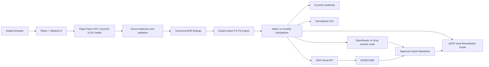

# MVA Unified Agent - Final Production Handover

Release date: 14 July 2026

Repository: `https://github.com/DrHayabusa/unified-tool`

Public frontend: `https://drhayabusa.github.io/unified-tool/`

This document is the definitive build, operation, validation, and reconstruction reference for the no-database MVA Unified Agent. It supersedes older UI mockup notes where behavior differs.

## 1. Product Scope

MVA is a browser-first vulnerability intake and remediation platform. It:

1. Accepts supported scanner CSV and modern XLSX exports.
2. Detects and validates the export format.
3. Normalizes source fields into one MVA schema.
4. Filters closed/suppressed records where the source provides a status.
5. Applies the approved exploit-aware P1-P4 matrix.
6. Calculates asset exposure on a 0-1000 scale.
7. Produces adhoc or multi-month dashboards.
8. Exports formatted Excel and normalized CSV reports.
9. Generates a customer-ready Remediation Guide PDF locally or through an AI provider.
10. Keeps the scanner comparison local and uses no database.

Implemented source workflows:

| Source | Adhoc | Monthly | Bundled samples |
|---|---:|---:|---:|
| Tenable.sc | Yes | Yes | Four months |
| Tenable.io | Yes | Yes | Four months |
| Qualys VMDR monthly export | Yes | Yes | Four months |
| Qualys VMDR adhoc export | Yes | N/A | One file |
| CrowdStrike Vulnerabilities | Yes | Yes | Four months |
| CrowdStrike Vulnerability per asset | Yes | Yes | One file plus compatible monthly logic |
| CrowdStrike Remediation per assets | Yes, weighted by `Count` | No, aggregated export | One file |
| MDVM | Planned | Planned | No |
| Custom CSV | Planned | Planned | No |

MDVM and Custom CSV are visibly disabled rather than pretending to work.

### Final Workflow Guarantees

- Monthly selections are session-owned and cumulative: separate drops add files instead of replacing the previous selection.
- Matching filenames replace only their earlier copy; every file can be removed independently or cleared as a group.
- Monthly results expose `Edit Monthly Files` with the selection preserved and `Dashboard` for source/mode navigation.
- CrowdStrike export choices and filename conventions are visible in both workflows. Remediation per assets remains correctly restricted to Adhoc.
- Adhoc analysis exposes Excel and normalized CSV downloads.
- CSV and XLSX use the same detection, normalization, scoring, dashboard, and reporting code after parsing.
- Prepared source workbooks include native Discovered and Remediated line charts. Browser-generated Monthly Excel includes the same two charts as embedded images.

## 2. Architecture



No scanner row is uploaded during parsing, comparison, dashboarding, Excel generation, or normalized CSV generation. AI is invoked only after an explicit user action.

## 3. Technology Stack

| Layer | Technology | Responsibility |
|---|---|---|
| UI | React 18 | State-driven source, mode, upload, dashboard, and report workflows |
| Build | Vite 6 | Development server, optimized production bundles, GitHub Pages base path |
| Visual system | Tailwind CSS 3 plus custom CSS | Dark cybersecurity design, responsive layout, color tokens, cards, motion |
| Charts | Recharts | Three-month line charts, priority bars, age/priority bars, sparklines |
| Icons | Lucide React plus custom source marks | Accessible action and scanner identity symbols |
| CSV input | Papa Parse | Header parsing, worker mode for files over 5 MB, warnings |
| XLSX input | ExcelJS, lazy-loaded | Finds a recognized scanner header in the first 30 rows of each worksheet |
| Browser Excel output | ExcelJS, lazy-loaded | Monthly/adhoc reports, complete normalized findings, and embedded trend charts |
| Browser PDF | jsPDF, lazy-loaded | Approved Remediation Guide rendering and download |
| Reference engine | Python 3 standard library | Independent normalization/dashboard regression oracle |
| Reference PDF | ReportLab | Deterministic team sample and semantic/visual validation artifact |
| Hosting | GitHub Pages + GitHub Actions | Public static frontend |
| Optional API | Python prototype at `tools/mva_api_server.py` | NVIDIA proxy and enterprise PDF endpoint contract |
| Database | None | Stateless, upload-process-download architecture |

Heavy export packages are code-split. ExcelJS is loaded only when the user requests an Excel file; jsPDF is loaded only for PDF generation.

## 4. Repository Map

```text
react-ui/src/App.jsx                         application shell and workflow state
react-ui/src/components/                     source, upload, dashboards, exports, AI UI
react-ui/src/lib/vulnerabilityEngine.js      browser normalization and calculations
react-ui/src/lib/vulnerabilityEngine.test.js regression and source tests
react-ui/src/lib/uploadFiles.js               cumulative upload, deduplication, and removal rules
react-ui/src/lib/uploadFiles.test.js          upload-state regression tests
react-ui/src/lib/reportExport.js             Excel and normalized CSV exports
react-ui/src/lib/pdfReport.js                prompt, local Markdown, PDF renderer
react-ui/src/lib/aiProviders.js               provider catalog and request layer
react-ui/src/lib/aiProviders.test.js          provider security and payload tests
mva_engine/tenable_normalizer.py              independent Python normalizer
mva_engine/tenable_dashboards.py              independent Python dashboards
tools/run_release_validation.py               complete release validation
tools/run_browser_80k_validation.mjs          browser-engine 80,000-row test
tools/validate_workbook.py                    workbook structural checks
tools/validate_remediation_pdf.py             PDF semantic checks
docs/AI_PDF_GENERATION_PROMPT.md              strict AI report contract
samples/                                      downloadable raw scanner test packs
output/                                       approved sample artifacts and evidence
.github/workflows/deploy-pages.yml             public deployment
```

## 5. Canonical MVA Schema

Every supported source maps to:

```text
IP Address
DNS Name
Vulnerability Name
CVE
Severity
Exploit Availability
Patch Priority
Asset Exposure (on 1000)
Vulnerability Finding
Summary
Description
Remediation
KB Links
Platform Details
First Discovered
Last Observed
Record Count
```

Internal enrichment fields include source ID, finding key, protocol, port, status, product, source export type, vulnerability age, asset criticality, internet exposure, CISA KEV, tags, and group names.

The deterministic finding identity is built from:

```text
asset identifier + source vulnerability identifier/name + CVE + protocol + port/product
```

The concatenated lower-case value is hashed with 32-bit FNV-1a. Month-to-month movement uses this stable key, not row position.

## 6. Source Mapping

### Tenable.sc

Primary mappings:

| MVA field | SC field |
|---|---|
| Asset | `IP Address`, `DNS Name`, fallback `NetBIOS Name` |
| Vulnerability | `Plugin`, `Plugin Name`, fallback `Synopsis` |
| Severity | `Severity`, fallback `Risk Factor` |
| Exploit | `Exploit?`, `Exploit Ease`, `Exploit Frameworks` |
| Exposure | `Vulnerability Priority Rating`, `ACR`, `AES` |
| Finding evidence | `Plugin Output` |
| Remediation | `Steps to Remediate` |
| Links | `See Also`, `Cross References` |
| Platform | `CPE`, `Repository`, `Family` |
| Dates | `First Discovered`, `Last Observed` |

### Tenable.io

Primary mappings:

| MVA field | IO field |
|---|---|
| Asset | `asset.display_ipv4_address`, `asset.ipv4_addresses`, `scan.target` |
| DNS | `asset.display_fqdn`, `asset.host_name`, `asset.name`, `asset.netbios_name` |
| Vulnerability | `definition.id`, `definition.name`, `definition.cve` |
| Severity | `definition.severity`, fallback `severity` |
| Exploit | `definition.exploitability_ease`, malware/Nessus exploit flags, VPR exploit maturity |
| Exposure | `definition.vpr.score`, `definition.vpr_v2.score` |
| Finding evidence | `output` |
| Remediation | `definition.solution`, `definition.workaround` |
| Links | `definition.see_also`, `definition.references` |
| Platform | `asset.operating_system`, `asset.operating_systems`, `asset.system_type` |
| Dates and age | `first_observed`, `last_seen`, `vuln_age`, `age_in_days` |

Native `vuln_age`/`age_in_days` takes precedence over date subtraction.

### Qualys

Primary mappings:

| MVA field | Qualys field |
|---|---|
| Asset | `IP`, `FQDN`, `DNS`, `NetBIOS` |
| Vulnerability | `QID`, `Title`, `CVE ID` |
| Severity | Qualys 0-5 `Severity` normalized to Info-Critical |
| Exploit | `Exploitability`, `Associated Malware` |
| Exposure | `CVSS4 Base`, `CVSS3.1 Base`, `CVSS Base` |
| Finding evidence | `Results` |
| Summary/description | `Threat`, `Impact` |
| Remediation | `Solution` |
| Links | `Vendor Reference`, `Bugtraq ID` |
| Platform | `OS`, `Category`, `Instance` |
| Dates | `First Detected`, `Last Detected` |

Monthly rows with Fixed, Closed, Resolved, Remediated, or Ignored status are excluded.

### CrowdStrike

Detailed Vulnerabilities/Vulnerability per asset mappings use Hostname, LocalIP, Host ID, Vulnerability ID, CVE ID, CVE Description, Severity, Product, remediation fields, advisory fields, Created Date, and Last Scan Time.

Exploit availability is true when either:

```text
Exploit status label/value indicates availability
OR Is CISA KEV is true
```

`ExPRT Rating` is enrichment only and is not treated alone as evidence that exploit code exists.

Suppressed, Closed, Fixed, Resolved, Remediated, or Inactive records are excluded.

Remediation per assets is aggregated. Its `Count` field is used as `Record Count`, so all totals and distributions are weighted correctly. It is intentionally rejected for monthly identity comparison.

## 7. Priority Matrix

| Exploit availability | Critical | High | Medium | Low |
|---|---:|---:|---:|---:|
| Yes / Available | P1 | P1 | P2 | P2 |
| No / Unavailable | P2 | P2 | P3 | P4 |

Exploit parsing is case-insensitive. Explicit negative values such as No, False, 0, None, Unavailable, Unproven, and No Known Exploit remain false. Available, Exploited, Functional, Weaponized, Confirmed, PoC, True, Yes, or a positive numeric count become true.

## 8. Asset Exposure

General sources:

1. Use a source score when present.
2. Multiply 0-10 values by 100.
3. Clamp to 0-1000.
4. Otherwise use a severity baseline and add 80 for exploit availability.

Fallback baselines:

```text
Critical 900
High     720
Medium   480
Low      220
Info      80
```

CrowdStrike uses CVSS base score, asset criticality, exploit availability, CISA KEV, and internet exposure. The final value is clamped to 0-1000.

## 9. Adhoc Workflow

Input: one supported CSV.

Output dashboard:

```text
Total vulnerabilities
Distinct affected assets
Critical / High / Medium / Low / Info totals
P1 / P2 / P3 / P4 totals
Immediate patch needed (P1 + P2)
Exploit available
Top 10 affected assets
Top products where available
Top recommended remediations where available
```

The Excel workbook contains an Adhoc Report sheet and Report Data sheet. The PDF target month is inferred from the latest observation date when possible.

## 10. Monthly Workflow

Input requirements:

1. At least two CSV files.
2. One export per month.
3. Filenames should contain `Month YYYY` for deterministic ordering.
4. Tenable.sc and Tenable.io may be mixed because their identity model is compatible.
5. CrowdStrike aggregated Remediation per assets is not accepted for monthly comparison.

Required dashboards, and only these primary views, are produced:

1. Vulnerabilities discovered in the last three uploaded months - line chart.
2. Total open vulnerabilities - new plus not closed.
3. Total open by P1/P2/P3/P4.
4. Total open by age and priority for >7, >30, >60, and >180 days.
5. Vulnerabilities patched in the last three month transitions - line chart.

Movement formulas:

```text
new = max(0, current record count - previous record count), summed by finding key
not closed = min(previous record count, current record count), summed by finding key
patched = max(0, previous record count - current record count), summed by finding key
total open = new + not closed
latest patched = previous total open + new this month - current total open
```

The implementation also validates the patched formula against direct key differences.

Age buckets are cumulative, not mutually exclusive. A 200-day P1 contributes to >7, >30, >60, and >180. `>180 days` means more than approximately six months.

## 11. Report Exports

### Browser Excel

Monthly workbook:

```text
Monthly Report
Report Data
```

Adhoc workbook:

```text
Adhoc Report
Report Data
```

The workbook uses frozen headers, filters, readable widths, color-coded severity/priority values, and no `Lane` column.

### Normalized CSV

Exports the canonical MVA report schema with exploit availability rendered as Yes/No.

### Remediation Guide PDF

The approved document identity is:

```text
Title: Remediation Guide
Report Type: Remediation
Tool Source: source selected/detected in MVA
Reporting Month: selected month
```

The PDF includes a contents section, report summary, P1-P4 ordered remediation actions, affected counts/assets, CVE and severity metadata, advisory links, prerequisites, numbered actions, fenced command blocks, rollback, validation, and reference appendix.

It must not include a customer name, purpose section, created-by line, internal prompt wording, invented CVEs, invented KBs, invented links, or unsupported commands.

The exact AI contract is `docs/AI_PDF_GENERATION_PROMPT.md` and the browser prompt builder is `react-ui/src/lib/pdfReport.js`.

## 12. AI Provider Design

| Provider option | Default model | Route |
|---|---|---|
| OpenRouter - Nemotron 3 Ultra | `nvidia/nemotron-3-ultra-550b-a55b:free` | Direct OpenAI-compatible HTTPS |
| Groq - GPT OSS 120B | `openai/gpt-oss-120b` | Direct OpenAI-compatible HTTPS |
| NVIDIA NIM - MVA Cloud Proxy | `nvidia/nemotron-3-ultra-550b-a55b` | MVA API `/health/nvidia` and `/generate/pdf` |
| MVA Cloud API | `mva-remediation-agent` | Organization API `/health` and `/generate/pdf` |
| Template PDF - No AI | None | Local browser generation |

Direct cloud mode sends only the dashboard summary and up to 80 highest-priority normalized findings. Raw CSV comparison remains local.

Provider keys are session-only. Switching providers clears the key. OpenRouter attribution headers are added according to its API contract. All AI requests have bounded token counts and timeouts. Reasoning traces are not rendered into customer reports.

NVIDIA's provider endpoint is server-compatible but not directly browser-compatible due CORS. Use OpenRouter's Nemotron route for direct hosted testing or deploy the MVA Cloud API for the NVIDIA key.

See `docs/API_KEYS.md` for the full security contract.

## 13. Run Locally

Prerequisites:

```text
Node.js 20 or later
npm
Python 3.11 or later for reference tools
```

Start the React application:

```bash
cd "/Users/mohammedshahid/Documents/New project/unified-tool"
chmod +x run-react-ui.sh
./run-react-ui.sh
```

Open `http://127.0.0.1:8800/`.

Manual commands:

```bash
cd react-ui
npm ci
npm run dev
```

Optional local NVIDIA proxy test:

```bash
./run-local-api.sh
```

The prototype listens on `http://127.0.0.1:8000`. It is not a hardened production server.

## 14. Public Deployment

The workflow `.github/workflows/deploy-pages.yml` runs on `main` and:

1. Checks out the repository.
2. Installs `react-ui` dependencies with `npm ci`.
3. Runs the production build.
4. Uploads `react-ui/dist` as a Pages artifact.
5. Deploys GitHub Pages.

Vite uses the repository base path `/unified-tool/` for production.

Verify deployment:

```bash
gh run list --workflow deploy-pages.yml --limit 5
curl -I https://drhayabusa.github.io/unified-tool/
```

## 15. Sample Data

Tenable.sc and Tenable.io:

```text
samples/tenable_100_row/
```

Qualys:

```text
samples/qualys_100_row/
```

CrowdStrike:

```text
samples/crowdstrike_100_row/
```

The same packs are copied into `react-ui/public/sample-data/` so **Load 4-Month Test Pack** works from GitHub Pages.

Download-ready archives:

```text
output/sample-packs/MVA_All_Supported_Source_Samples.zip
output/sample-packs/MVA_Tenable_SC_IO_4_Month_Samples.zip
output/sample-packs/MVA_Qualys_Samples.zip
output/sample-packs/MVA_CrowdStrike_Samples.zip
```

Expected CrowdStrike monthly movement:

| Month | Total | New | Patched |
|---|---:|---:|---:|
| April 2026 | 110 | 0 | 0 |
| May 2026 | 120 | 30 | 20 |
| June 2026 | 125 | 25 | 20 |
| July 2026 | 120 | 20 | 25 |

## 16. Final Team Artifacts

```text
output/excel/mva_unified_final_team_sample.xlsx
output/excel/mva_crowdstrike_final_team_sample.xlsx
output/pdf/mva_final_remediation_guide.pdf
output/validation/VALIDATION_EVIDENCE.md
output/validation/release_validation.json
output/validation/browser_80000_rows.json
```

## 17. Validation

Run the complete release checks:

```bash
python3 -m unittest -v tests.test_crowdstrike_and_regressions
python3 tools/run_release_validation.py
node tools/run_browser_80k_validation.mjs
cd react-ui
npm test
npm run build
npm audit --audit-level=moderate
```

Validate final artifacts:

```bash
python3 -m pip install -r requirements-validation.txt
python3 tools/validate_workbook.py --input output/excel/mva_unified_final_team_sample.xlsx --output output/validation/workbook-unified-final
python3 tools/validate_workbook.py --input output/excel/mva_crowdstrike_final_team_sample.xlsx --output output/validation/workbook-crowdstrike-final
python3 tools/validate_remediation_pdf.py output/pdf/mva_final_remediation_guide.pdf
```

Acceptance criteria:

```text
All source headers represented in samples
All approved priority-matrix cells pass
SC, IO, Qualys, and CrowdStrike regression totals pass
Monthly movement and all five dashboard views pass
80,000 rows complete within the release performance threshold
Excel reopens with no repair and has no formula errors
PDF starts with %PDF, has required sections, links, commands, and no forbidden wording
React production build succeeds
npm audit reports zero moderate-or-higher vulnerabilities
Tracked secret scan returns no matches
Public Pages URL returns HTTP 200
```

## 18. Rebuild Procedure

To reproduce the agent from an empty project:

1. Create a Vite React application.
2. Add Tailwind, Recharts, Lucide, Papa Parse, ExcelJS, and jsPDF.
3. Define source detection before implementing UI uploads.
4. Define the canonical MVA schema and one normalizer per export family.
5. Build the deterministic finding key and weighted record-count behavior.
6. Implement the priority matrix as a pure tested function.
7. Implement adhoc metrics as pure reductions over normalized findings.
8. Implement monthly maps keyed by finding identity, then calculate new/carried/patched counts.
9. Implement cumulative age thresholds using native source age when available.
10. Build source and mode selection, then upload gates, then dashboards.
11. Add lazy Excel/CSV exports and authoritative completion/error UI states.
12. Add local PDF generation before external AI, so reports always remain available.
13. Add AI providers through one OpenAI-compatible request layer and a separate backend contract.
14. Generate deterministic sample packs with controlled monthly movement.
15. Build independent Python regression calculations to catch JavaScript drift.
16. Add 80,000-row performance validation.
17. Add artifact semantic/visual validation.
18. Deploy only after tests, audit, secret scan, and production build pass.

## 19. Adding The Next Scanner

For MDVM or another source:

1. Obtain official raw exports for adhoc and monthly layouts.
2. Record every header and identify status semantics.
3. Add a strict source-detection signature.
4. Map asset, vulnerability ID, CVE, severity, exploit signal, evidence, remediation, links, platform, dates, and native age.
5. Define which rows are open and which are excluded.
6. Define whether counts are row-level or aggregated/weighted.
7. Add at least four monthly samples with known new/patched movement.
8. Add priority, mapping, adhoc, monthly, and cross-source regression tests.
9. Copy the samples into the public sample-data directory.
10. Enable the source tile only after the complete release suite passes.

## 20. Production Hardening Beyond GitHub Pages

The current public deployment is suitable for demos and controlled local-file analysis. An internal enterprise rollout should add:

```text
SSO/OIDC authentication
role-based authorization
organization-hosted HTTPS MVA API
secret manager integration
provider allowlists and egress controls
CORS origin allowlist
rate and request-size limits
malware scanning for uploaded files
security headers and CSP
central audit events without raw vulnerability content
retention policy if storage is later introduced
container image and dependency scanning
backup/DR only if persistent services are added
```

Do not add a database merely for convenience. Add persistence only after defining data ownership, retention, encryption, tenant separation, and deletion requirements.

## 21. Troubleshooting

| Symptom | Cause | Resolution |
|---|---|---|
| GitHub Pages 404 | Wrong Vite base path or Pages workflow not complete | Confirm `/unified-tool/`, Actions success, and Pages source GitHub Actions |
| Monthly says one month | Filenames lack distinct `Month YYYY` or only one file selected | Rename files and upload at least two distinct months |
| Source mismatch | Selected tile does not match detected headers | Choose the correct source or inspect the export type |
| No findings | All rows were closed/suppressed or required IDs/assets are empty | Review source status values and raw headers |
| NVIDIA direct browser failure | Provider CORS policy | Use OpenRouter Nemotron or an HTTPS MVA Cloud API |
| Provider 401 | Invalid/expired/incomplete key | Generate a fresh provider-specific key |
| PDF waits too long | Large/free model queue or provider limit | Retry, choose Groq, or use Template PDF |
| Port 8800 in use | Existing development server | Reuse `http://127.0.0.1:8800/` or stop the old process |
| Excel appears silent | Browser download control or popup policy | Read the in-app export status and browser downloads list |

## 22. Security Invariants

1. No real key in tracked files.
2. No raw CSV/XLSX upload leaves the browser for local dashboards and exports.
3. No AI call without explicit user action.
4. Provider switch clears credentials.
5. Direct provider key is sent in the Authorization header only.
6. AI receives at most 80 prioritized normalized findings.
7. Local template PDF always remains available.
8. No invented remediation details are allowed by the prompt contract.
9. Closed/suppressed source rows do not appear as open findings.
10. Every public release is gated by tests, build, audit, artifact validation, and secret scan.
