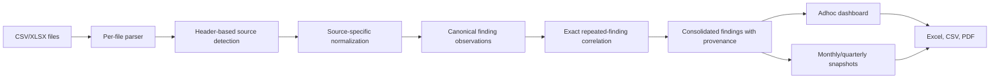

# MVA Unified Multi-Tool Analysis

## 1. Purpose

Unified Multi-Tool mode lets an organization select two or more supported vulnerability scanners and analyze their exports as one source-aware dataset.

The current supported source families are:

| Source family | Accepted export variants |
|---|---|
| Tenable.sc | Tenable Security Center finding export |
| Tenable.io | Tenable Vulnerability Management dot-notation export |
| Qualys | Monthly and Adhoc VMDR finding exports |
| CrowdStrike | Vulnerabilities and Vulnerability per asset exports |

CrowdStrike Remediation per assets is intentionally excluded from cross-tool totals because its `Count` field is aggregated. Adding aggregate counts to one-row-per-finding exports would mix two units of measure and inflate the result.

Single Tool mode is preserved. No source-specific parser, priority calculation, dashboard requirement, or export path was removed.

## 2. User Workflow

1. Select `Unified Multi-Tool` in Source Choice.
2. Select any two or more implemented scanner tiles.
3. Select Adhoc Scan, Monthly Data Comparison, or Quarterly Analysis.
4. Add CSV/XLSX files in one browse action or across separate drag/drop actions.
5. Remove any individual file or clear the complete selection before analysis.
6. Run analysis locally in the browser.
7. Review consolidated totals, per-source coverage, repeated observations removed, and source provenance.
8. Download the Excel report, normalized CSV, or Remediation Guide PDF.

Matching filenames replace the older selected copy. Every differently named file is appended. This prevents accidental duplicate uploads while allowing repeated drag/drop actions.

## 3. Data Flow



Scanner data remains in the browser for parsing, mapping, comparison, dashboard generation, Excel generation, CSV generation, and local PDF generation. Only an explicit AI action sends the prepared report context to an AI endpoint.

## 4. Source Selection Contract

Single Tool engine calls continue to pass one source ID:

```js
"tenable-sc"
```

Unified engine calls pass an explicit selector:

```js
{
  mode: "multi",
  sourceIds: ["tenable-sc", "tenable-io", "qualys", "crowdstrike"]
}
```

Every parsed file is checked against the selected source families. An unexpected scanner file fails with its filename, detected source, and allowed sources instead of being silently ignored.

## 5. Canonical Finding Schema

Every source adapter produces the same core fields:

| Canonical field | Purpose |
|---|---|
| `ipAddress` | Asset network identity |
| `dnsName` | Asset DNS/FQDN identity |
| `vulnerabilityName` | Human-readable finding identity |
| `cve` | Standard vulnerability identity where available |
| `severity` | Critical, High, Medium, Low, Info, or Unknown |
| `exploitAvailable` | Boolean scanner exploit signal |
| `patchPriority` | P1, P2, P3, or P4 |
| `assetExposure` | Exposure score from 0 to 1000 |
| `vulnerabilityFinding` | Scanner evidence/output |
| `summary` | Short source synopsis |
| `description` | Detailed source description |
| `remediation` | Source solution/remediation |
| `kbLinks` | Vendor and knowledge-base links |
| `platformDetails` | OS, product, platform, or CPE context |
| `firstDiscovered` | Earliest known finding date |
| `lastObserved` | Latest observed finding date |
| `protocol` | Service protocol where supplied |
| `port` | Service port where supplied |
| `sourceTools` | Every scanner contributing to a consolidated finding |
| `sourceDisplay` | Human-readable source provenance |

Source-only metadata remains available where it is required for exposure, reporting, or future adapters.

## 6. Exploit and Priority Logic

Each adapter maps its scanner signal into `exploitAvailable`.

| Scanner | Primary signal |
|---|---|
| Tenable.sc | `Exploit?`, with Exploit Ease as supporting context |
| Tenable.io | `definition.exploitability_ease` and supported exploit indicators |
| Qualys | `Exploitability` and associated exploit/malware context |
| CrowdStrike | Exploit status, exploit count, or CISA KEV evidence |

For a correlated finding, Exploit Available becomes `Yes` when any contributing scanner reports a positive signal.

| Severity | Exploit Available: Yes | Exploit Available: No |
|---|---:|---:|
| Critical | P1 | P2 |
| High | P1 | P2 |
| Medium | P2 | P3 |
| Low | P2 | P4 |

Priority is recalculated after correlation. It is not copied from whichever source was parsed first.

## 7. Duplicate Definition

A duplicate is not an asset duplicate. A scanner observation can be merged only when all three identity dimensions align:

1. Asset identity matches by exact normalized DNS/FQDN or exact IP address.
2. Vulnerability identity matches by CVE; when no CVE exists, the exact normalized vulnerability name is used.
3. Service identity matches by protocol and port; product is a fallback when port is unavailable.

Examples:

| SC observation | IO observation | Result |
|---|---|---|
| Asset A + CVE-1 + TCP/443 | Asset A + CVE-1 + TCP/443 | One consolidated finding with SC + IO provenance |
| Asset A + CVE-1 + TCP/443 | Asset A + CVE-2 + TCP/443 | Two findings |
| Asset A + CVE-1 + TCP/443 | Asset B + CVE-1 + TCP/443 | Two findings |
| Asset A + same CVE + TCP/443 | Asset A + same CVE + TCP/8443 | Two findings |

The engine deliberately does not use fuzzy vulnerability-name matching. If scanners disagree on CVE and normalized name, the records remain separate. This favors a visible false negative over an invisible false positive.

## 8. Repeated-Finding Correlation

Correlation is based on finding identity, never asset identity alone:

1. Build an exact vulnerability/service signature from CVE (or normalized name), protocol, port, and product fallback.
2. Build exact asset aliases from normalized DNS/FQDN and IP.
3. Find prior groups sharing the signature and at least one asset alias.
4. Merge all matching observations, including repeats from the same scanner and matching observations from other scanners.
5. If a later record contains both DNS and IP and connects two previously separate alias groups, merge those groups into one canonical finding.
6. Build the stable comparison key from canonical asset identity plus vulnerability/service signature. Scanner-native IDs and discovery dates do not create duplicate rows.

For example, multiple Tenable plugin IDs or Qualys QIDs representing the same CVE on the same asset and service become one finding. Their scanner IDs and source provenance are retained as distinct values. A different CVE, a different normalized vulnerability name, a different asset, or a different service remains a separate finding.

## 9. Conflict Resolution

When observations correlate, the consolidated record uses these rules:

| Field | Merge rule |
|---|---|
| Source tools | Union of contributing scanner families |
| Severity | Highest severity |
| Exploit Available | Logical OR |
| Patch priority | Recalculated from merged severity and exploit availability |
| Asset exposure | Highest score |
| First discovered | Earliest valid date |
| Last observed | Latest valid date |
| Vulnerability age | Highest supplied age |
| CVE | Normalized union of CVE values |
| Description/summary/remediation | Most descriptive non-empty value |
| KB links/platform/tags | Distinct values retained |
| CISA KEV/internet exposed | Logical OR |
| Source observation count | Sum, for audit only |
| Record count | Maximum, never sum across scanners |

Summing record counts across scanners would reintroduce the duplicate count that correlation removed.

## 10. Adhoc Analysis

Unified Adhoc accepts one or more files from the selected scanner families for the same current-state reporting cycle.

The dashboard shows:

| Measure | Meaning |
|---|---|
| Source observations | Open normalized observations before correlation |
| Consolidated open | Unique open findings after correlation |
| Repeats removed | Source observations minus consolidated open |
| Source cards | Findings observed by each scanner; these cards can overlap |
| Total Open | Deduplicated open findings |
| Severity/P1-P4 | Calculated from consolidated findings |
| Top 10 affected assets | Deduplicated open findings grouped by asset |

The remediation queue displays `Source Tools` for each row in Unified mode.

## 11. Monthly Historical Analysis

The reporting month is detected from the filename first and then from finding dates when necessary. Files with the same detected month are grouped into one source-aware snapshot.

Example input:

```text
April: SC + IO + Qualys + CrowdStrike
May:   SC + IO + Qualys + CrowdStrike
June:  SC + IO + Qualys + CrowdStrike
July:  SC + IO + Qualys + CrowdStrike
```

Sixteen files become four snapshots. At least two distinct months are required; two scanner files for the same month are one snapshot and are not a historical comparison.

The approved dashboard calculations remain:

```text
Total Open = New Vulnerabilities + Not Closed From Previous Month

Patched Last Month = Previous Month Open + New This Month - Current Month Open
```

The five required views are:

1. Vulnerabilities discovered in the last three uploaded months as a line chart.
2. Total open vulnerabilities, split into new and not closed.
3. Total open by P1/P2/P3/P4.
4. Total open by P1/P2/P3/P4 against >7, >30, >60, and >180 days.
5. Vulnerabilities patched in the last three uploaded months as a line chart, with the latest formula shown.

Each historical snapshot records its file count, scanner families, normalized observations, consolidated open findings, and repeated observations removed. A changed scanner set between months remains visible in the source audit because it can affect movement totals.

## 12. Quarterly Analysis

Quarterly mode represents one current reporting cycle containing up to the latest three months of discovery dates. In Unified mode, it accepts one current export per selected scanner, consolidates the current state, and renders the same rolling three-month discovery line chart.

It does not require three separate monthly exports. A future multi-quarter comparison can be added as a separate workflow without changing this definition.

## 13. Export Contract

Unified Excel workbooks contain:

| Worksheet | Content |
|---|---|
| Adhoc/Monthly/Quarterly Report | Existing dashboard layout and required charts |
| Report Data | Complete canonical findings with Source Tools and Record Count |
| Source Audit | Input files, scanner count, consolidated total, repeats removed, source coverage, and period history |

Normalized CSV includes the same canonical finding columns and source provenance.

The local PDF and optional AI PDF use consolidated findings. Raw scanner files are not sent to the model.

## 14. Performance

The correlation path uses indexed candidate sets keyed by vulnerability/service signature and asset aliases. It does not compare every row with every other row.

Validation on 14 July 2026:

| Scenario | Result |
|---|---:|
| Raw observations | 80,000 |
| Unique correlated findings | 20,000 |
| Scanner families | 4 |
| Correlation time | 524 ms |
| End-to-end synthetic object build + correlation | 589 ms |
| Node heap used | Approximately 98 MB |
| Findings retaining all four source labels | 100% |
| Correlation key collisions | 0 |

CSV/XLSX parsing time depends on file size, device memory, and XLSX complexity. CSV remains the preferred input for very large exports because XLSX parsing has more memory overhead.

## 15. Automated Validation

The JavaScript suite contains 39 passing tests after this feature.

Multi-tool regression coverage includes:

| Test | Required result |
|---|---|
| Four-source Adhoc | 495 observations -> 160 unique asset-vulnerability-service findings |
| Source provenance | Raw file audit retains 125 SC + 125 IO + 125 Qualys + 120 CrowdStrike observations |
| Repeated finding matching | 335 same-finding observations removed; 40 SC/IO/Qualys identities correlated |
| Four-month Unified | 16 files -> 4 monthly snapshots |
| Required dashboards | All five validation checks pass |
| Different vulnerabilities on same asset | Two findings, never deduplicated |
| Same identity with distinct scanner-native IDs | One finding with merged provenance |
| Same vulnerability on different services | Separate findings |
| Exploit conflict | `Yes` wins and priority is recalculated |
| Same-month-only upload | Rejected as insufficient history |
| CrowdStrike aggregate mixed with detailed files | Rejected with an actionable explanation |
| Unified workbook | Report Data provenance and Source Audit worksheet present |

Localhost browser validation covered:

1. Four-tool default selection.
2. Unified Adhoc sample loading and analysis.
3. Individual file removal and re-append without overwriting other files.
4. Sixteen-file Monthly loading and consolidation into four periods.
5. All five required monthly dashboard headings.
6. Historical source audit for April through July.
7. Unified Quarterly consolidation and rolling line chart.
8. Excel, normalized CSV, and local PDF success states.

## 16. Key Files

| File | Responsibility |
|---|---|
| `react-ui/src/App.jsx` | Single/Unified selection state and workflow orchestration |
| `react-ui/src/components/SourceChoice.jsx` | Single Tool versus Unified Multi-Tool UI |
| `react-ui/src/components/UploadPanel.jsx` | Cumulative Adhoc/Quarterly upload state |
| `react-ui/src/components/MonthlyComparison.jsx` | Cumulative historical uploads and required dashboards |
| `react-ui/src/components/SourceCoveragePanel.jsx` | Source coverage and consolidation audit UI |
| `react-ui/src/components/RemediationQueue.jsx` | Prioritized rows with source provenance |
| `react-ui/src/lib/uploadFiles.js` | Append, replace-same-name, and remove behavior |
| `react-ui/src/lib/vulnerabilityEngine.js` | Detection, normalization, correlation, snapshots, and calculations |
| `react-ui/src/lib/reportExport.js` | Excel/CSV report and Source Audit worksheet |
| `react-ui/src/lib/vulnerabilityEngine.test.js` | Identity, monthly, priority, and source regression tests |
| `react-ui/src/lib/reportExport.test.js` | Workbook completeness and provenance tests |

## 17. Recommended Database

No database was added in this release, as requested. The best first production database for MVA is PostgreSQL.

PostgreSQL fits this platform because it combines transactional integrity, relational joins, unique constraints, date-range partitioning, row-level security, and indexed `jsonb` for scanner-specific metadata. PostgreSQL documents built-in range/list/hash partitioning and partition pruning for large tables, recommends `jsonb` for most queryable JSON use cases, supports GIN indexes for `jsonb`, and provides row security policies for tenant isolation:

- [PostgreSQL table partitioning](https://www.postgresql.org/docs/current/ddl-partitioning.html)
- [PostgreSQL JSON/JSONB and indexing](https://www.postgresql.org/docs/current/datatype-json.html)
- [PostgreSQL row-level security](https://www.postgresql.org/docs/current/ddl-rowsecurity.html)

Recommended storage split:

| Data | Storage |
|---|---|
| Organizations, users, sources, ingestion jobs | PostgreSQL |
| Canonical findings and monthly observations | PostgreSQL partitioned by reporting month |
| Scanner-only metadata | PostgreSQL `jsonb` |
| Raw CSV/XLSX and generated PDF/XLSX artifacts | S3-compatible object storage |
| Background job status/cache | Redis only when asynchronous workers are added |

Recommended initial tables:

```text
organizations
users
scanner_sources
ingestion_batches
uploaded_files
assets
vulnerability_definitions
finding_observations
canonical_findings
snapshot_findings
report_artifacts
audit_events
```

`finding_observations` should preserve every source observation. `canonical_findings` should hold the correlated identity. The relationship between them provides the same provenance shown in the current browser-only Source Audit.

Partition `finding_observations` and `snapshot_findings` by reporting month when the table becomes large. Apply `organization_id` to every tenant-owned row and enforce it with row-level security. Store raw files outside PostgreSQL and keep their hash, object path, source, period, size, uploader, and retention date in `uploaded_files`.

ClickHouse is not the recommended first system of record. It is a high-performance column-oriented OLAP database intended for large analytical workloads. It becomes useful as a secondary analytics store when MVA reaches hundreds of millions or billions of observations and interactive aggregation becomes the dominant workload: [ClickHouse introduction](https://clickhouse.com/docs/intro).

## 18. Database Implementation Path

The database phase can be implemented without changing the current React dashboards:

```text
React + Tailwind
        |
FastAPI REST API
        |
PostgreSQL + Alembic migrations
        |
S3-compatible object storage
        |
Optional worker queue for large ingestion/report jobs
```

Recommended sequence:

1. Freeze the canonical finding and source-observation contracts.
2. Add organization authentication and authorization.
3. Add PostgreSQL schema and Alembic migrations.
4. Move parsing/correlation into an idempotent ingestion service.
5. Store raw-file hashes to prevent duplicate ingestion.
6. Persist source observations before correlation.
7. Persist canonical findings and snapshot membership in one transaction.
8. Recompute dashboards with SQL/API queries and compare them with the current browser engine fixtures.
9. Add object-storage retention and deletion controls.
10. Add encryption, audit events, backups, restore testing, and tenant-isolation tests before production use.

The current no-database implementation remains appropriate for local evaluation and sensitive one-session analysis. PostgreSQL should be added when the organization requires shared history, multi-user access, scheduled ingestion, durable reports, or cross-customer operations.
